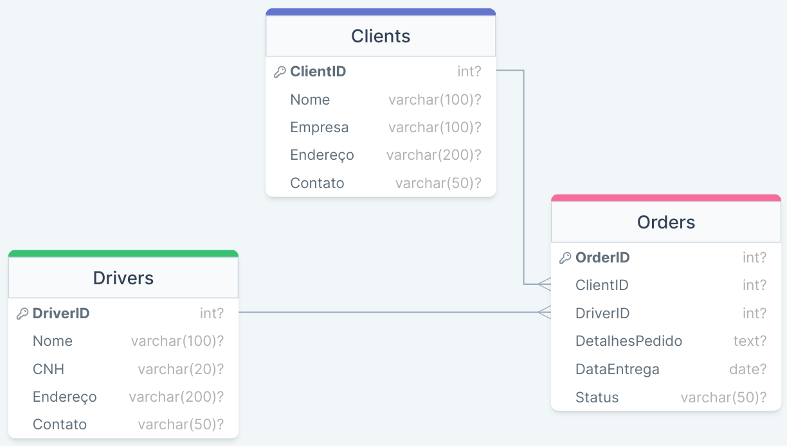

# LogiMove Transportes - Banco de Dados no Azure SQL

A LogiMove Transportes, uma empresa renomada no setor de logística de transporte,
enfrenta desafios significativos em sua operação diária. A coordenação entre
agendadores, despachantes, motoristas e clientes é crucial, mas o processo atual,
baseado em formulários de papel e comunicações telefônicas, tem se mostrado
ineficiente.Para resolver esses desafios, a empresa decide migrar para um sistema digital,
substituindo formulários de papel e chamadas telefônicas por documentos digitais e
comunicação online. A implementação de autenticação digital permitirá uma
coordenação e acompanhamento eficazes das remessas, acessíveis via navegador web
ou aplicativo móvel. Banco de dados Azure SQL criado baseado no que foi pedido na missão prática do nível 4 (RPG0026 - Tirando proveito da nuvem para
projetos de software) do Mundo 4 no curso de Desenvolvimento Full-Stack da Estácio.

## Stack utilizada

**Cloud:** Azure SQL

## Screenshots

    

  
